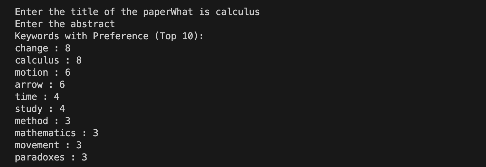
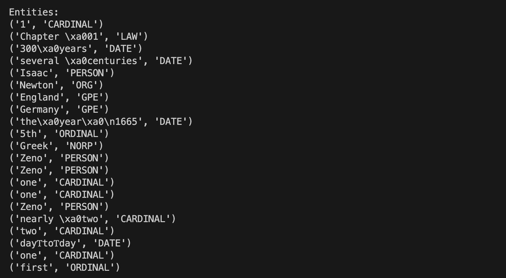
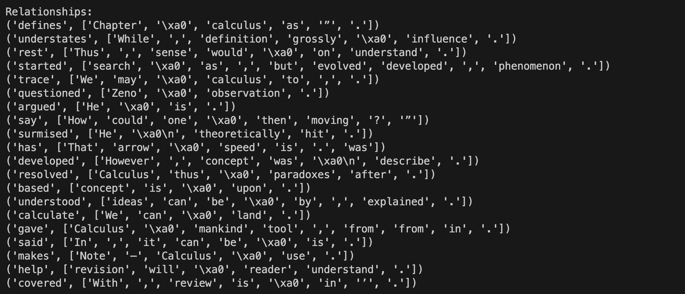
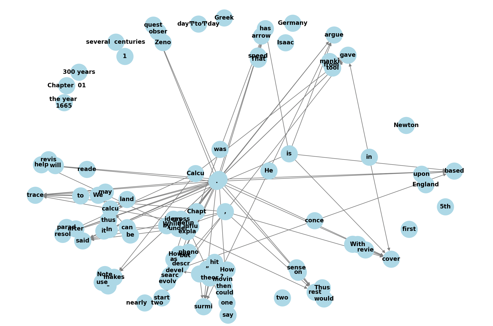

# Re5earch_learn

## Overview

This project utilizes PDF extraction, NLP, and web-scraping modules to better understand and help in the reading and learning of scientific papers.

## Features

- **PDF Text Extraction:** Utilizes PDF parsing techniques to extract text content from PDF documents.

- **NLP Techniques:** Applies NLP methods such as POS tagging, lemmatization, and keyword extraction to analyze the extracted text.

- **Knowledge Graph Creation:** Generates a knowledge graph based on the identified keywords and their relationships.

- **Entity Relationship Extraction:** Identifies and extracts entity relationships within the text.

- **Web Scraping:** Uses requests and BeautifulSoup for web scraping to fetch basic definitions of keywords from "The Scientific Dictionary" website.

- **Google API Integration:** Utilizes the Google API to search for and retrieve definitions of keywords from Google search results.

## Installation

1. Clone this repository:  
`git clone https://github.com/your-username/pdf-text-analysis.git`

2. Install the required Python packages: 
`pip install -r requirements.txt`

3. Configure the project settings and API keys as needed 

4. Run the project using the provided scripts and modules.

## Usage

- In the 'extract_pdf' module, add the file path for the pdf you want to extract. The other modules will use this file, as long as they are in the same directory as the first module.

- To use the web scraping module, you will need to go to `https://console.cloud.google.com` and generate a new API key.

## Results

- ***Keywords extracted*** The program will take the title of the paper and the abstract as an input to further specify the weights and scores associated with the keywords generated.

- ***Entity and Relations*** Given the Extracted text, The inherent entity-relations will be extracted.

  
- ***Knowledge Graph*** These Entity-Relations will be used as edges and nodes for the Knowledge Graph. 

## Contributing

If you'd like to contribute to this project, please follow these guidelines:

1. Fork the repository.
2. Create a new branch for your feature or improvement.
3. Make your changes and submit a pull request.

Feel free to reach out for questions, feedback, or collaborations related to this project.

